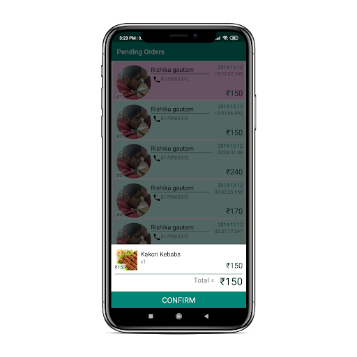
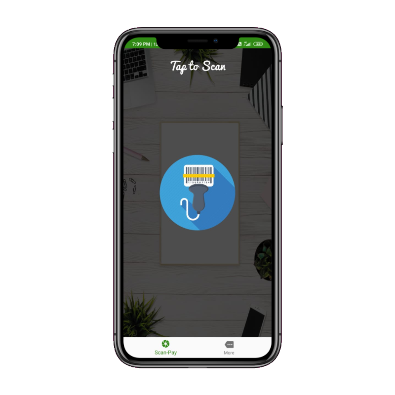
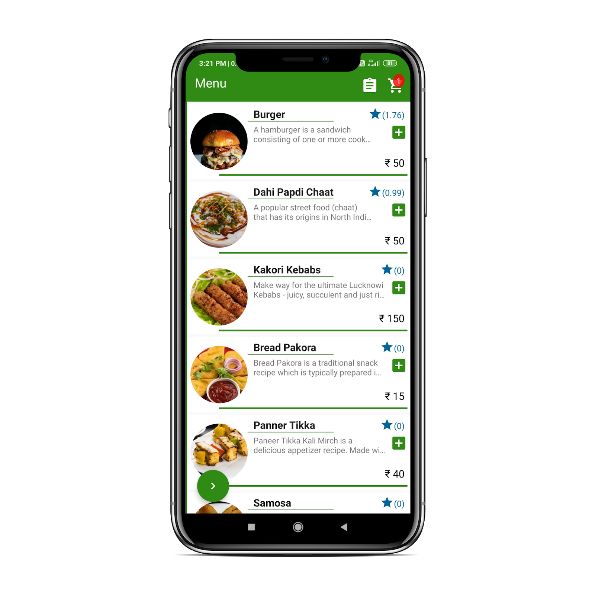
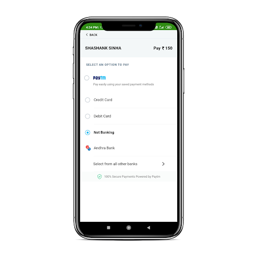
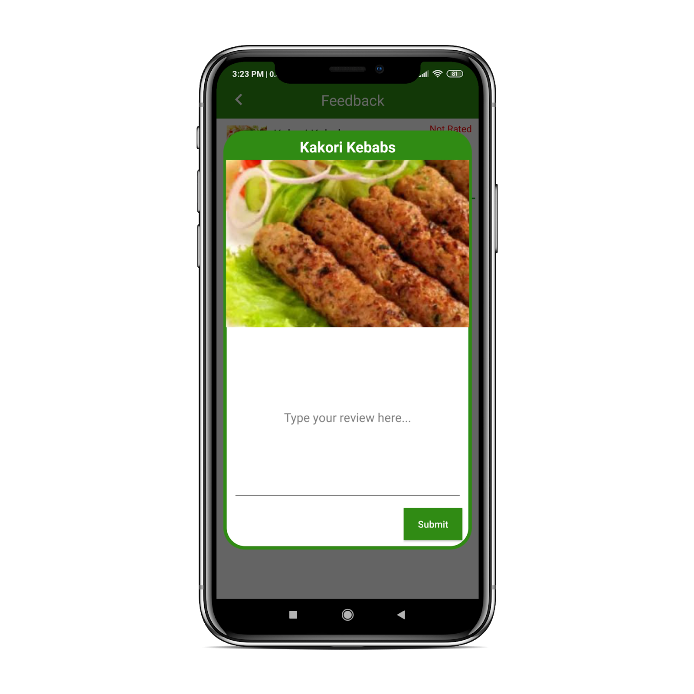
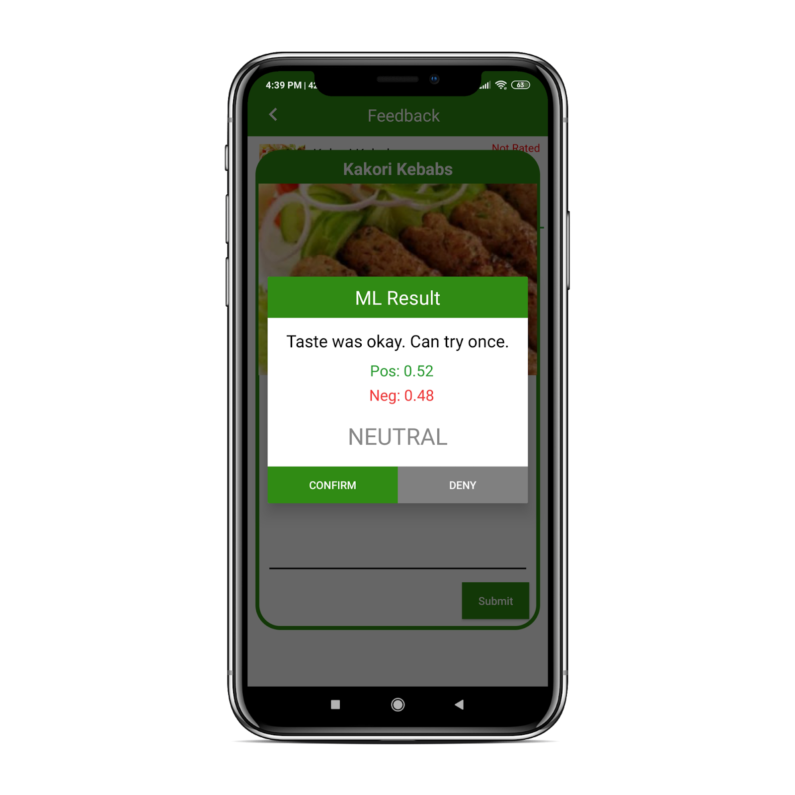
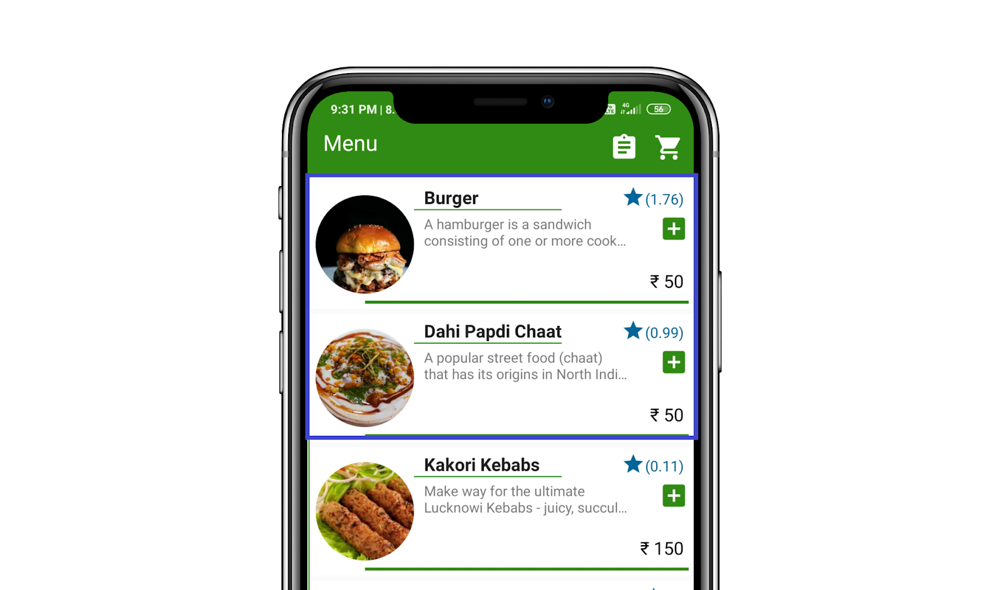
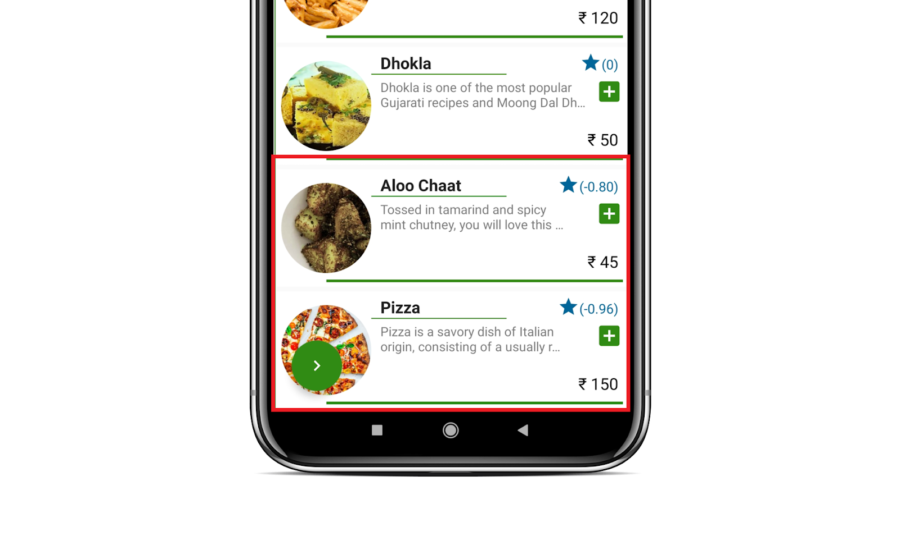

# Food Ordering Application with Review Analyzer
 
 This is a food ordering application which was inspired from food ordering system used by restaurants in China. There are two android applications in this project : 
 
 - #### User Application- Just Eat
 - #### Manager Application- Just Eat Chef
  
 
 | Just Eat                            | Just Eat Chef                       |
 |-------------------------------------|-------------------------------------|
 | | |
 
  
 
 
 
 ## 1. Just Eat
 
The main aim of my project was to create a food recommendation system using machine learning model which will be integrated in an android application that will allows users to order food and drinks in a fast and convenient way. Basically, my project consists of three major parts, i.e. 

- Sentimental analysis of feedback given by the customers using RNN.
- Integration of machine learning model in android application.
- Ranking each food item in the menu based on the feedback given by the users. 
 

First, I built and trained RNN model on Amazon food review dataset. Model was trained on around 3 lakh reviews and tested on 1 lakh reviews.

- Training Accuracy = ~93 %
- Testing Accuracy = ~91 %

tf.Keras model was converted into tflite model. Then, it was used inside Android Application to perform sentiment analysis on reviews given by users about their orders.

 

User application works in 5 stages- 

1. User goes to restaurant, scan QR code at table, select his dishes, make payment and confirm his order.
2. Restaurant manager/chef receives his order and confirms it when his order is server at table.
3. User give his feedback about his individual order.
4. Feedback is analysed by ML model and a score is generated for each dishes based on customer review.
5. Food score of dishes ordered is updated and sorted accordingly in main menu.

 

### Application Workflow - 

|1. Login                                | 2. Scan QR Code                        | 3. Select Food                        | 4. Checkout |
| ---------------------------------------| -------------------------------------- |--------------------------------------|-------------|
|  |  |||

|5. Payment                              | 6. Order Confirmation         | 7. Give Review                       | 8. Review Result |
| ---------------------------------------| -------------------------------------- |--------------------------------------|-------------|
|  |  |||

 

Food Score will be updated after each review. Items having maximum food score will be at top and vice versa.

 

 | Max Scored Items                    | Min Scored Items                    |
 |-------------------------------------|-------------------------------------|
 |             |           |
 
   
 ## 2. Just Eat Chef
 
 This application will be used by Restaurant Manager. They will recieve notification when user places order. Once order is served at table, manager will confirm the order which will enable user to give review of their experience with their food.
 
   

### Key Features/Libraries used-
- Payment Gateway - Paytm
- Tflite - RNN Model
- Firebase Authentication
- Firebase Realtime Database
- Firebase Storage
- Glide
- Volley
- QR Code Scanner
- Image Compressor
- Image Cropper
  

 
 
 For more details about restaurant food ordering, [Click Here](https://sampi.co/wechat-app-restaurant-business/)
